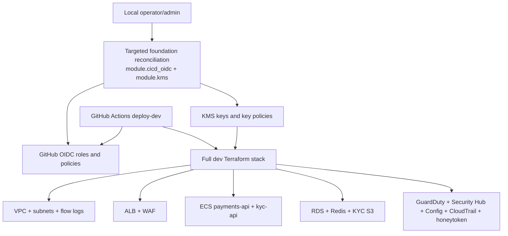

# Dev environment bootstrap and reconciliation

## Architecture diagram



This environment is deployed by GitHub Actions after the Terraform foundation exists.
The GitHub Actions apply role cannot reliably create or repair its own IAM permissions, and encrypted resources must not be created before the customer-managed KMS key policies are attached.

## Required order

1. Bootstrap remote state from `infra/bootstrap` if it does not already exist.
2. Apply the CI/CD OIDC and KMS foundation once from an operator/admin session.
3. Run the normal GitHub Actions deploy workflow.

## Operator reconciliation command

Run this locally only when the GitHub Terraform apply role or KMS key policies changed, or after a failed partial deploy left resources half-created:

```powershell
aws sts get-caller-identity
$env:TF_VAR_redis_auth_token =

terraform -chdir=infra/envs/dev init -reconfigure
terraform -chdir=infra/envs/dev apply -target="module.cicd_oidc" -target="module.kms"
```

After this succeeds, rerun `deploy-dev` in GitHub Actions.

## Why this exists

- `module.cicd_oidc` owns the GitHub OIDC roles and apply-role policies.
- `module.kms` owns customer-managed key policies used by CloudWatch Logs, Secrets Manager, S3, RDS, ElastiCache, CloudTrail, and Config.
- Normal CI/CD should use short-lived OIDC credentials, but it should not be expected to bootstrap missing permissions on the same role it has already assumed.

This keeps the project aligned with the constraint that GitHub Actions uses OIDC and no long-lived AWS keys, while making the one-time foundation step explicit and repeatable.
