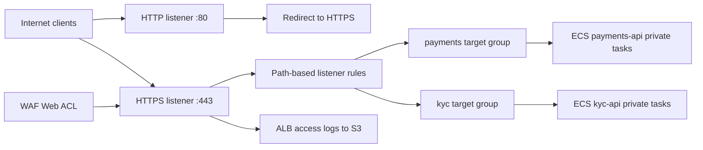

# ALB module

## Architecture diagram

This module owns the public Application Load Balancer entry point for SentinelPay.

Why it matters:

- It satisfies the edge requirement that inbound internet traffic terminates at an AWS-managed Layer 7 service.
- It keeps ECS tasks private by forwarding traffic to private-subnet target groups instead of exposing compute directly.
- It provides HTTPS termination, HTTP-to-HTTPS redirect, path-based routing, health checks, and ALB access logging.

Architecture role:

Internet clients reach the ALB first. The ALB is protected by the WAF module and routes requests to the private ECS services for `payments-api` and `kyc-api`.

Security justification:

- Application tasks are not internet-addressable.
- TLS is centralized at the edge.
- ALB access logs support investigation, audit, and detection use cases.
