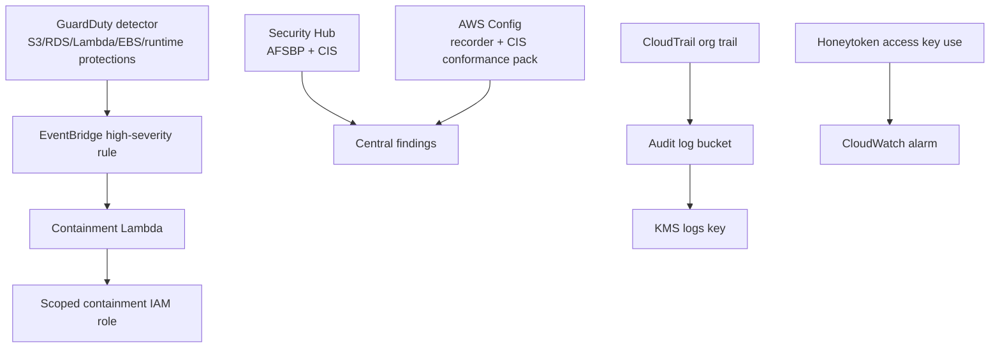

# Detection module

## Architecture diagram

This module owns cloud-native security detection and response controls.

Why it matters:

- It enables GuardDuty protection features for S3, RDS, Lambda, EBS, and ECS Fargate runtime monitoring.
- It enables Security Hub standards for AWS Foundational Security Best Practices and CIS benchmarking.
- It enables AWS Config recording and conformance checks.
- It routes high-severity GuardDuty findings to EventBridge for containment automation.

Architecture role:

Detection receives telemetry from AWS services and turns important security events into findings, compliance checks, and automated response signals.

Security justification:

- GuardDuty provides threat detection across workload, data, and account activity.
- Security Hub centralizes findings and compliance posture.
- AWS Config provides historical resource configuration evidence.
- EventBridge provides the response path for high-severity findings.
