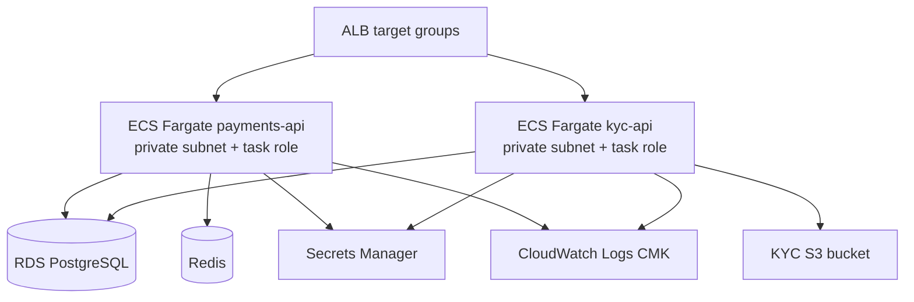

# ECS module

## Architecture diagram

This module runs the application services on ECS Fargate.

Why it matters:

- It deploys `payments-api` and `kyc-api` as separate services.
- It supports separate task roles so each service has its own AWS identity.
- It runs tasks in private subnets with no public IP addresses.
- It integrates with ALB target groups for private service routing.

Architecture role:

The ALB forwards traffic to ECS services running in private application subnets. ECS tasks consume RDS, Redis, Secrets Manager, S3, and CloudWatch Logs through scoped roles and security groups.

Security justification:

- Fargate reduces host-management exposure.
- Separate task roles support least privilege.
- Private subnet placement satisfies the no-direct-internet-compute requirement.
- Encrypted logs provide operational evidence without exposing containers publicly.
