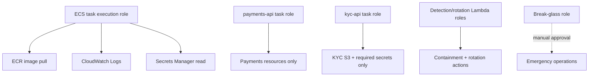

# IAM module

## Architecture diagram

This module owns project IAM roles and least-privilege runtime policies.

Why it matters:

- It creates separate ECS task roles for `payments-api` and `kyc-api`.
- It creates the ECS task execution role for image pulls and log delivery.
- It provides optional roles for detection Lambda, secret rotation Lambda, GitHub OIDC, and break-glass operations.

Architecture role:

IAM defines who each compute component is when it calls AWS APIs. Application modules consume these role ARNs rather than creating broad permissions locally.

Security justification:

- Runtime identity is separated from deployment identity.
- Payments and KYC services receive only the permissions they need.
- Policies avoid unrestricted `*` on `*` grants.
- Optional roles keep break-glass and automation permissions explicit.
