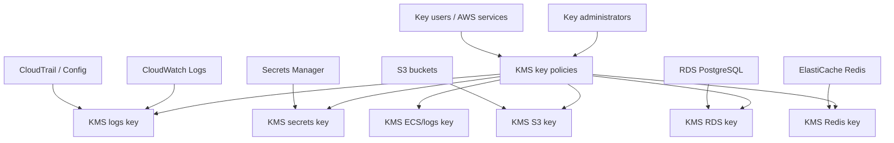

# KMS module

## Architecture diagram

This module creates customer-managed KMS keys for project encryption domains.

Why it matters:

- It satisfies the requirement that RDS, ElastiCache, S3, logs, secrets, and ECS-related encrypted data use customer-managed keys.
- It separates encryption purposes so access can be reasoned about and audited.

Architecture role:

Other modules receive KMS key ARNs from this module and use them for storage encryption, log encryption, secret encryption, and service-specific encryption.

Security justification:

- Customer-managed keys provide stronger policy control than AWS-managed keys.
- Separate keys reduce blast radius.
- Key rotation supports long-term cryptographic hygiene.

Production note:

Key policies should maintain separation between principals that administer keys and principals that only use keys for encryption/decryption.
