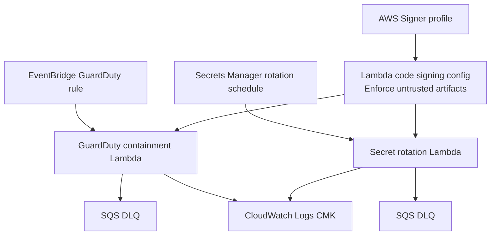

# Lambda module

## Architecture diagram

This module owns Lambda functions used for security automation and secret rotation.

Why it matters:

- It supports GuardDuty containment automation.
- It supports Secrets Manager rotation handlers.
- It enforces Lambda code signing with AWS Signer when enabled.

Architecture role:

Detection invokes the containment Lambda through EventBridge. Secrets Manager invokes the rotation Lambda for configured secrets. Lambda logs are encrypted with the logging KMS key.

Security justification:

- Code signing enforces that Lambda accepts only packages signed by the trusted AWS Signer profile.
- Log groups are encrypted with a customer-managed key.
- Secrets Manager invocation permission is scoped to configured secret ARNs.

CI/CD note:

The deployment pipeline must sign Lambda zip artifacts with AWS Signer before deployment when code signing is enabled.
