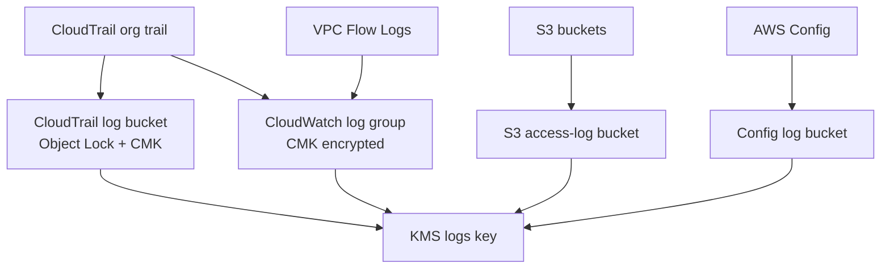

# Logging module

## Architecture diagram

This module owns audit and security log storage.

Why it matters:

- It creates CloudTrail logging with validation and encryption.
- It provides hardened S3 buckets for audit logs and access logs.
- It provides encrypted CloudWatch log groups and IAM permissions for log delivery.

Architecture role:

AWS services deliver audit and access logs into this module’s storage. Detection and monitoring modules depend on this evidence for investigation and response.

Security justification:

- CloudTrail log file validation protects audit integrity.
- Object Lock and versioning improve tamper resistance.
- KMS encryption protects stored logs.
- S3 public access blocks reduce accidental exposure.
