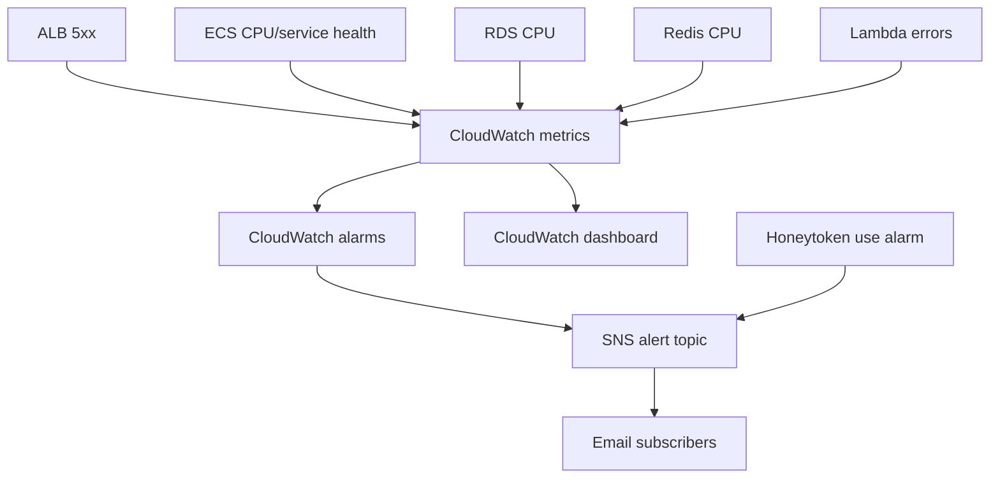

# Monitoring module

## Architecture diagram

This module owns operational observability and alert presentation.

Why it matters:

- It creates CloudWatch dashboards for core service health.
- It creates alarms for ALB, ECS, RDS, Lambda, and custom log-derived metrics.
- It provides SNS notification targets for operational alerts.

Architecture role:

Monitoring surfaces health and performance signals from the ALB, ECS services, database, cache, Lambda automation, and logs.

Security justification:

- Operational alerts help identify outages, abuse, and degradation quickly.
- Custom log metric filters allow security-relevant application events to become alarms.
- Monitoring is separated from detection: detection owns security services, monitoring owns observability and alert presentation.
