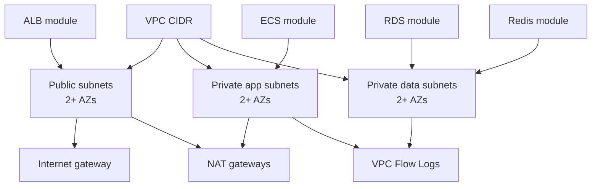

# Network module

## Architecture diagram

This module creates the VPC and subnet foundation.

Why it matters:

- It separates public, private application, and private data subnets.
- It places workloads across at least two Availability Zones.
- It keeps application and data resources away from direct internet exposure.

Architecture role:

The public subnets host internet-facing edge infrastructure such as the ALB. Private application subnets host ECS tasks. Private data subnets host RDS and Redis.

Security justification:

- Network segmentation reduces blast radius.
- Private subnets enforce the no-direct-internet-compute constraint.
- Multi-AZ placement supports availability and resilience.
