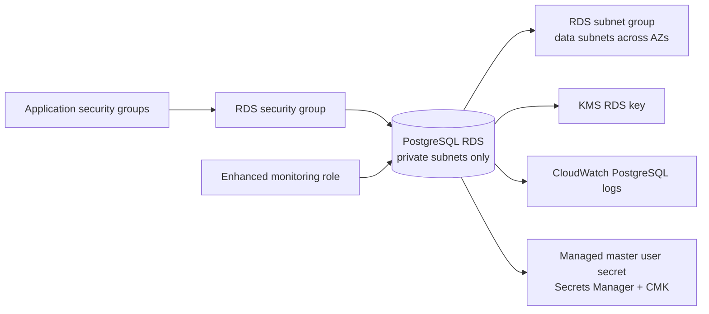

# RDS module

## Architecture diagram

This module owns the PostgreSQL database layer.

Why it matters:

- It provisions PostgreSQL in private data subnets only.
- It encrypts storage and performance insights with customer-managed KMS.
- It enables IAM database authentication and CloudWatch log exports.

Architecture role:

Payments and KYC services access PostgreSQL through security group references, not public endpoints or CIDR-wide access.

Security justification:

- `publicly_accessible = false` keeps the database private.
- Security group references restrict ingress to application security groups.
- RDS-managed master password support avoids storing database credentials directly in Terraform variables.
- Logging supports audit and investigation.
