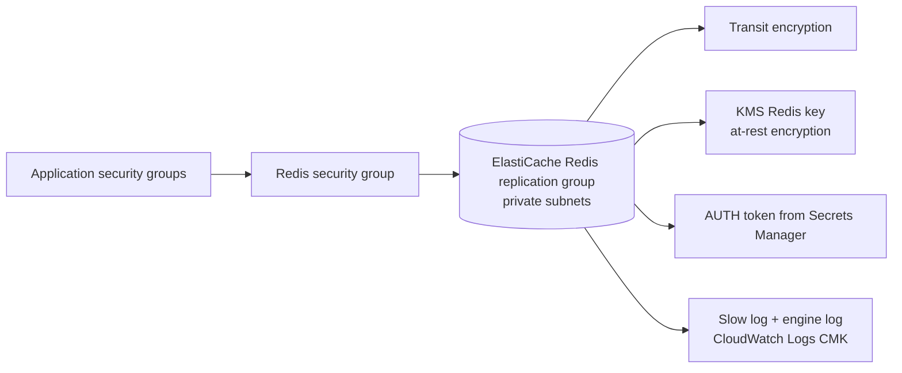

# Redis module

## Architecture diagram

This module owns the ElastiCache Redis layer.

Why it matters:

- It provides shared cache/rate-limit/session backing where needed.
- It runs in private data subnets.
- It enables encryption in transit and at rest.

Architecture role:

Application services connect to Redis privately through security groups. Redis supports app functionality such as rate limiting and transient state.

Security justification:

- Transit encryption protects cache traffic.
- At-rest encryption uses a customer-managed KMS key.
- Security groups restrict access to application tasks only.

Production note:

Avoid placing Redis auth tokens directly in Terraform state where possible. Prefer Secrets Manager and a controlled rotation workflow.
