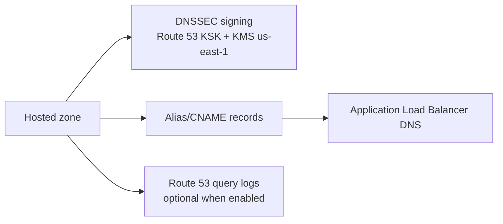

# Route 53 module

## Architecture diagram

This module owns DNS records and hosted zone DNSSEC.

Why it matters:

- It creates DNS records pointing to the ALB.
- It enables DNSSEC for hosted zones introduced by the deployment.
- It uses a Route 53 DNSSEC KMS signing key in `us-east-1`, as required by AWS.

Architecture role:

Route 53 maps public application names to the ALB while DNSSEC protects DNS integrity for the hosted zone.

Security justification:

- DNSSEC helps protect against DNS tampering and spoofing.
- ALIAS records avoid hard-coding load balancer IP addresses.

Operational note:

After enabling DNSSEC, the DS record must be configured at the domain registrar for full chain-of-trust validation.
