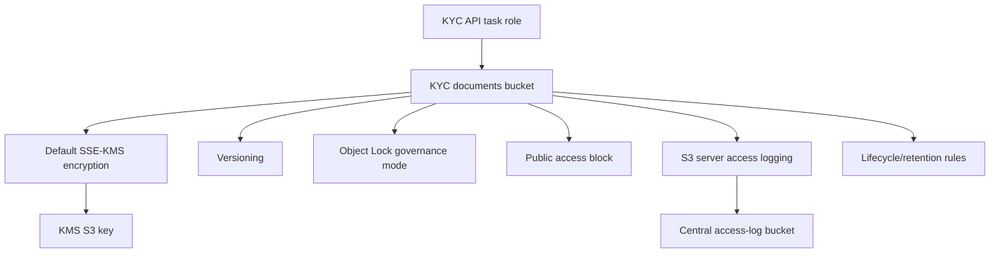

# S3 module

## Architecture diagram

This module owns the KYC document bucket.

Why it matters:

- KYC documents are sensitive regulated data.
- The bucket enforces encryption, versioning, public access blocks, access logging, and Object Lock governance mode.

Architecture role:

The KYC API stores and reads document objects from this bucket using its scoped task role. Access logs are delivered to the centralized logging bucket.

Security justification:

- KMS encryption protects stored documents.
- Object Lock governance mode improves tamper resistance.
- Versioning supports recovery and audit.
- Public access blocks prevent accidental exposure.
- Bucket policies deny insecure transport and incorrect encryption.
