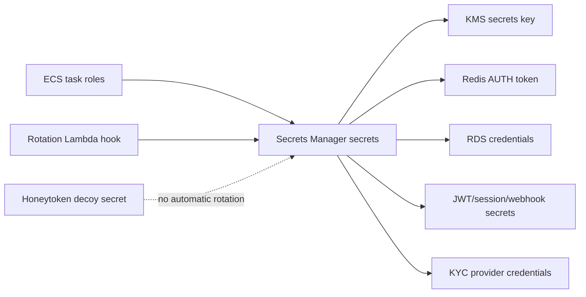

# Secrets module

## Architecture diagram

This module owns Secrets Manager secret metadata and access policies.

Why it matters:

- Runtime secrets must live in Secrets Manager, not code, environment files, or Terraform state.
- It creates named secret containers for JWT/session secrets, database credentials, Redis auth, provider credentials, and webhook secrets.

Architecture role:

Application task roles and rotation Lambdas access only the secrets they are allowed to consume or rotate.

Security justification:

- Secrets are encrypted with a customer-managed KMS key.
- Secret values are intentionally not created with Terraform to avoid storing sensitive material in state.
- Access policies can be scoped to specific task roles.

Operational note:

Populate secret values through a controlled process outside Terraform, then configure rotation where supported.

Rotation note:

Automatic rotation is wired through the Lambda module, but production rotation is only complete after the rotation Lambda package exists and each secret has a compatible rotation handler. Secret values should still be populated outside Terraform to avoid storing them in state.
