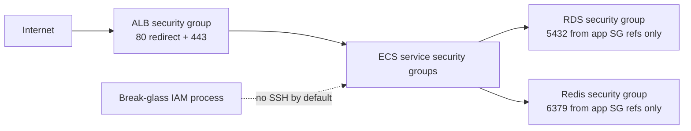

# Security groups module

## Architecture diagram

This module owns network access rules between infrastructure tiers.

Why it matters:

- It controls which resources can talk to ALB, ECS services, RDS, and Redis.
- It implements security group references rather than broad CIDR access for data services.

Architecture role:

The ALB security group accepts internet traffic. Application security groups accept traffic only from the ALB. RDS and Redis accept traffic only from application security groups.

Security justification:

- No SSH ingress is allowed.
- RDS and Redis are not exposed to the internet.
- Security group references satisfy the data-plane constraint for database ingress.
