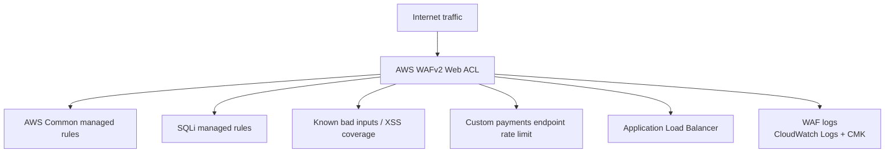

# WAF module

## Architecture diagram

This module owns AWS WAF protection for the edge.

Why it matters:

- It attaches WAF to the regional Layer 7 entry point.
- It enables managed rule groups for common threats, SQL injection, known bad inputs, and reputation lists.
- It includes a custom rate-limit rule scoped to payment paths.

Architecture role:

Traffic reaches WAF before being processed by the ALB and private application services.

Security justification:

- Managed rules reduce exposure to common web attack classes.
- Payment-specific rate limiting reduces abuse risk against sensitive endpoints.
- WAF logs provide security evidence for investigation and tuning.
